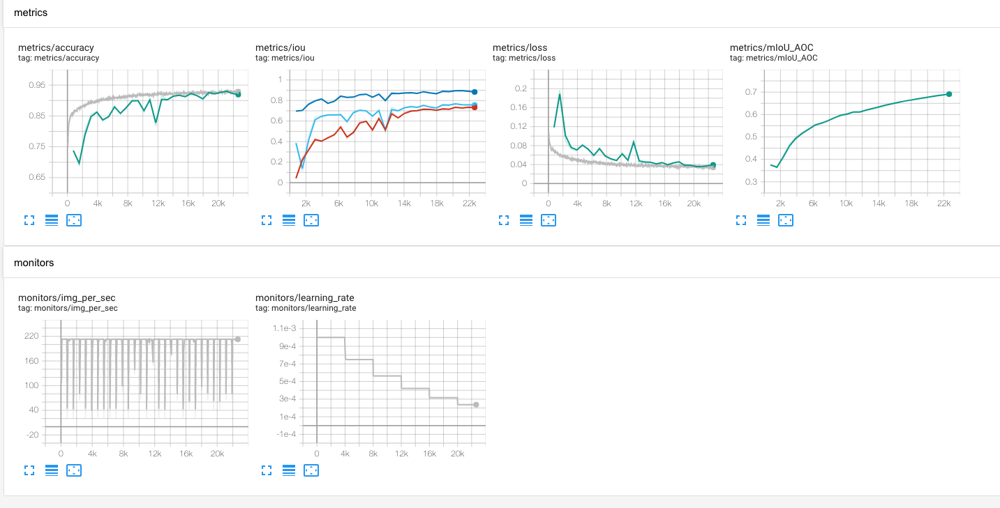

# atlas_dgcnn

An Update and Tensorflow 2 port of code written by Miguel Domingez in this repo:
https://github.com/WDot/pointnet2-argonne

The Dynamic Graph CNN (DGCC) network topology was originally proposed here:
https://github.com/WangYueFt/dgcnn

The input data can be provided as a tarball upon request. Then the test dataset can be setup using this command:
```bash
python tools/build_dataset.py -i /path/to/tarball.tgz -o /destination/path/for/dataset
```
This unpacks the data into the destination path and writes two files `zej_train.txt` and `zej_test.txt` which contain a list of filenames for training and testing with roughly 20% for testing and 80% for training. The tarball is 9GB in size, and expands to 57GB.

The base configuration file `configs/atlas_dgcnn.json` should be edited so that under the `data` section these parameters point to the created file lists:
```json
      "train_filelist":                "/destination/path/for/dataset/zej_train.txt",
      "test_filelist":                 "/destination/path/for/dataset/zej_test.txt",
```

The application is launched with `python main.py` and comes with various command line options. To run a training run do the following for a single process:
```bash
python main.py -c configs/atlas_dgcnn.json --logdir logdir/$(date +"%Y-%m-%d-%H-%M")
```
With MPI use
```bash
mpirun -n <ranks> python main.py -c configs/atlas_dgcnn.json --logdir logdir/$(date +"%Y-%m-%d-%H-%M") --horovod
```

The application can be configured via the json formatted config file. There you can set:
* the number of epochs to traing `config['training']['epochs']`
* how often to print the status message `config['training']['status']`
* set the batch size `config['data']['batch_size']`
* control the optimizer and loss and learning rate schedule: `config['optimizer']` `config['loss']` `config['lr_schedule']`

Examples of how run on ThetaGPU with `submit_scripts/thetagpu_dgcnn.sh` 

The model is defined in `model/dgcnn.py` using the `tf.keras` interfaces.
The dataset is loaded via the `tf.dataset` interface here `data_handler/atlas_pointcloud_csv.py`

To give an idea of performance I ran a 4-node (4x8=32 mpi rank) job on ThetaGPU using the configuration `configs/atlas_dgcnn_thetagpu.json` and saw these metrics during training:


These metrics are ouput to Tensorboard in the path passed to `--logdir` on the command line.

With 1 rank on ThetaGPU (1 A100): training rate is 7.3 imgs/sec, inference rate is 10.4 imgs/sec
With 8 ranks on ThetaGPU (8 A100s): training rate is 58.1 imgs/sec (58.1/7.3 = 7.95), inference rate is 83.3 imgs/sec (83.3/10.4 = 8.00)

The 32 rank test gave a training rate of about 210 imgs/sec (210/7 = 30).
